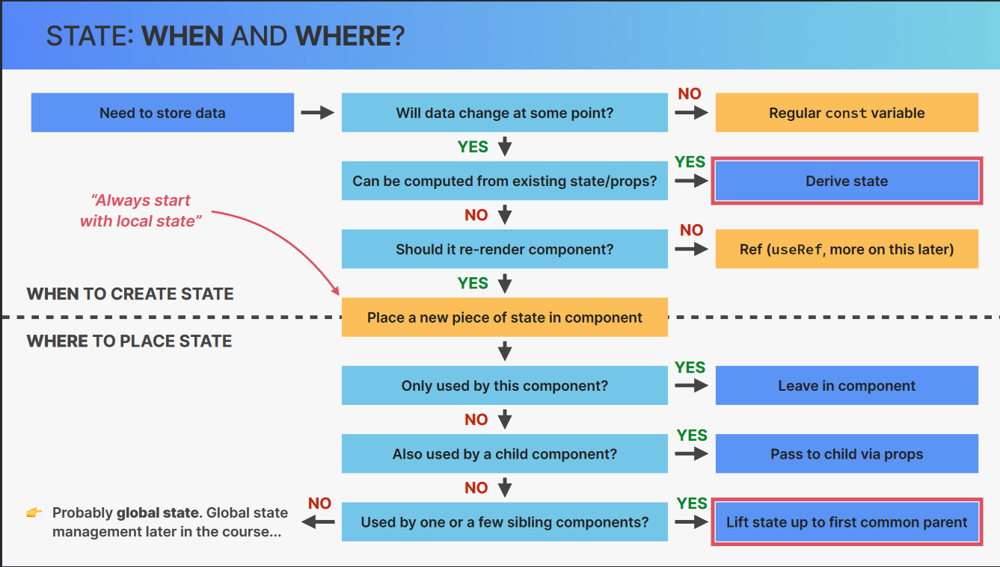

## WHAT IS THINKING IN REACT

"Thinking in React" is a core skill

        How to work with React API
                   |
                   |
                   |
                   |
            Thinking in React

In the intersection of the two skills This is where professional React apps are built.

## Thinking in React

`React Mindset`

Thinking about components, state,data flow,effects etc .

- Thinking is state transitions, not element mutations

## THE “THINKING IN REACT” PROCESS:

1. Break the desired UI into components and
   establish the component tree

2. Build a static version in React (without state)

3. Think about state:
   👉 When to use state
   👉 Types of state: local vs. global
   👉 Where to place each piece of state

4. Establish data flow:
   👉 One-way data flow
   👉 Child-to-parent communication
   👉 Accessing global state

`Point 3 and 4 collectively are called "State Management`

## WHEN YOU KNOW HOW TO “THINK IN

    REACT”, YOU WILL BE ABLE TO ANSWER:
    “THINKING IN REACT” AS A PROCESS
    🤔 How to break up a UI design into components?
    🤔 How to make some components reusable?
    🤔 How to assemble UI from reusable components?
    🤔 What pieces of state do I need for interactivity?
    🤔 Where to place state? (What component should "own" each piece of state?)
    🤔 What types of state can or should I use?
    🤔 How to make data flow through app?

## What is State Management?

Deciding when to create pieces of
state, what types of state are necessary, where to place
each piece of state, and how data flows through the app
🏠 Giving each piece
of state a home

## types of State: Local vs. Global

### Local State

    👉 State needed only by one or few components
    👉 State that is defined in a component and only that component and child components have access to it (by passing via props)
    ☝ We should always start with local state

### Global State

    👉 State that many components might need
    👉 Shared state that is accessible to every component in the entire application

    It is done with the help of the context APi and Redux

## Where to place each piece of state?

## Sharing Stare with Sibling Components 

`In React we have one-way data flow show we can't pass data from child to parent or from sibling to sibling`

`To solve this problem we use a technique called "Lifting State Up"`

`Lifting State Up` is the process of moving the state from the child component to the parent component

`State was lifted up to the closest common ancestor of the components that need to share state`

`As we can't change the props in the React ` So we have to pass the function from the parent component to the child component and then call that function in the child component to change the state in the parent component`

`It is known as the ` **Child-to-Parent Communication** (inverse data flow) : `child updating parent's state`

## Deriving State 

**Derived State** : State that is computed from and existing piece of state or from props

