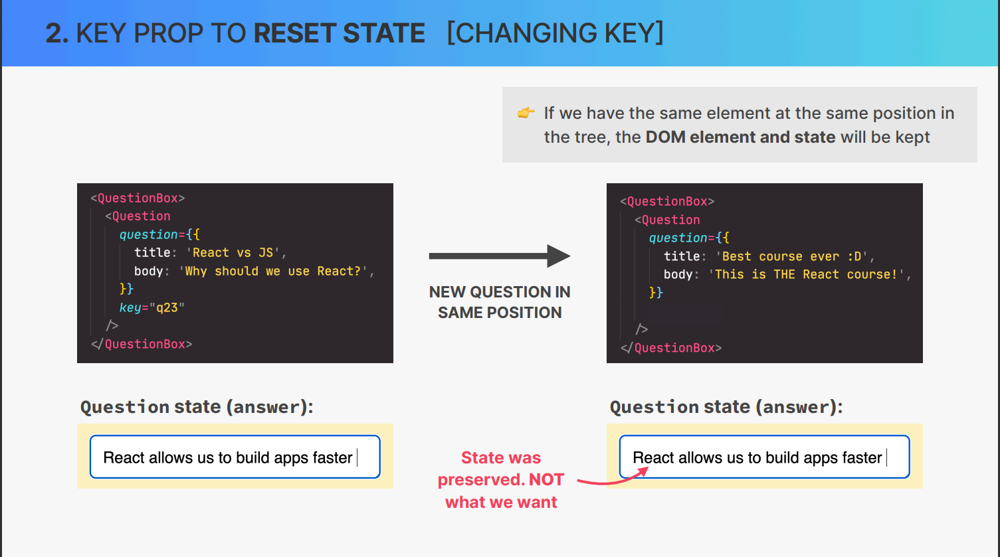
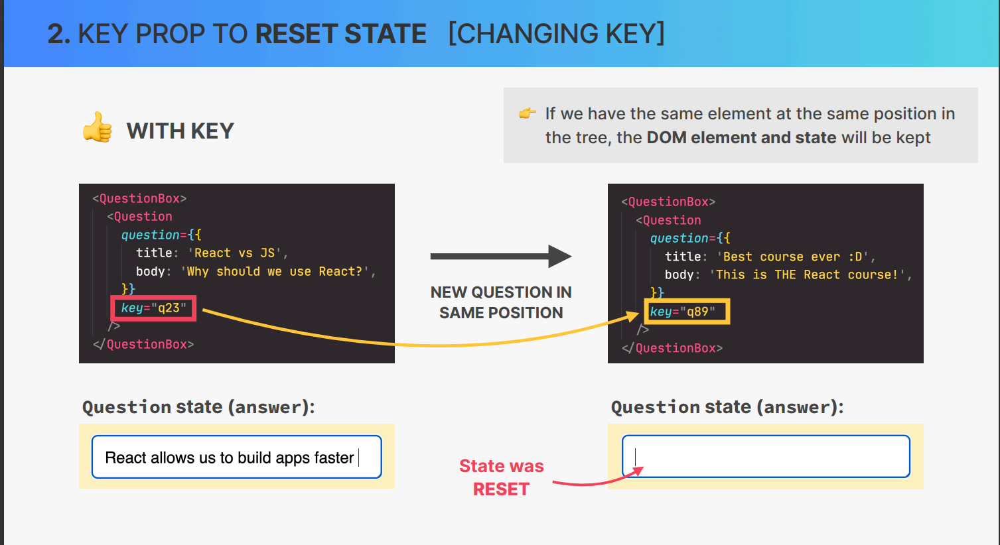

## How React Works `Behind the Scenes`

### `Component vs Instance vs Element`


 **Components** 

        👉 Description of a piece of UI
        👉 A component is a function that returns React elements (element tree), usually written as JSX
        👉 “Blueprint” or “Template”

**Instances**

        👉 Instances are created when we “use” components
        👉 React internally calls Tab()
        👉 Actual “physical” manifestation of a component
        👉 Has its own state and props
        👉 Has a lifecycle (can “be born”, “live”, and “die”


**Elements**

    👉 JSX is converted to React.createElement() function calls
    👉 A React element is the result of these function calls
    👉 Information necessary to create DOM element


```   
     Component
Component Instance
React Element
RETURNS
DOM Element (HTML)
INSERTED TO DOM

```


## HOW RENDERING WORKS: OVERVIEW 

### How Components Are Displayed ON THE SCREEN


- RENDER IS TRIGGERED (by updating state somewhere)


- RENDER PHASE (React calls component functions and figures out how DOM should be updated)


- Commit Phase (React actually writes to the DOM, updating, inserting and deleting elements)

- Browser paints DOM changes to the screen (It is not related to React, it is a browser thing)


☝ In React, rendering is NOT updating the DOM or displaying elements on the screen. 
Rendering only happens internally inside React, it does not produce visual changes.


###  How Renders are Triggered

`Render is Triggered`


**THE TWO SITUATIONS THAT TRIGGER RENDERS:**

1. `Initial render` of the application.
2. `State is updated` in one or more component instances (re-render)


```text 

     👉 The render process is triggered for the entire application
     👉 In practice, it looks like React only re-renders the component where the state update happens, but that’s not how it works behind the scenes
     👉 Renders are not triggered immediately, but scheduled for when the JS engine has 
     some “free time”. There is also batching of multiple setState calls in event handlers

```


The MECHANICS OF STATE IN REACT 

```

UPDATED STATE <--------------
     |                      |            
     |                      |            
     |                      |            
     |                      | (update state)           
RENDER/RE-RENDER            |
     |                      |
     |                      |
     |                      |
   VIEW (event Handler) ----|


```

NOT TRUE #1 ❌: RENDERING IS UPDATING THE SCREEN / DOM
NOT TRUE #2 ❌: REACT COMPLETELY DISCARDS OLD VIEW (DOM) ON RE-RENDER


### The Render Phase


`RENDER PHASE`


```
     Component instances 
     that triggred re-render
               |
               |
         React Elements
               |
               |
        New Virtual DOM


```


## The virtual DOM (REACT ELEMENT TREE)

1️⃣ Initial Render 


     Component Tree
          |
     React Element Tree (Virtual DOM)


👉 Virtual DOM: Tree of all React 
elements created from all 
instances in the component tree
👉 Cheap and fast to create multiple 
trees
👉 Nothing to do with “shadow DOM”

`Shadow Dom` it is related to web components


🚨 Rendering a component will 
cause all of its child components 
to be rendered as well (no matter 
if props changed or not)

`It is necessary because React does not know wheather children will be affected`


```
                Component instances 
                that triggred re-render
                          |
                          |
                    React Elements
                          |
                          |
                   New Virtual DOM
                          |
Current                   |
Fiber tree                |
(before state -----> Reconciliation
update)                + Diffing
                         |
                         |
                         |
                      Updated Fiber tree   


```


## What is Reconciliation and why do we need it ? 

🤔 Why not update the entire DOM whenever state changes somewhere in the app?
          |
          |  (because)

👉 That would be inefficient and wasteful:

1. Writing to the DOM is(relatively) slow
2. Usually nly a small part of the DOM needs to be updated 

👉 **React reuses** as much of the existing DOM as possible 
          |
          | (How?)

💖 **Reconciliation** : Deciding which DOM elements actually need to be inserted, deleted, or updated, in order to reflect the latest state change


### The Reconclier : FIBER

React ELEMENT TREEE (VIRTUAL DOM)
     |
     | (for initial Render)
     | 
Fiber Tree 

👉 Fiber Tree: internal tree that has a "fiber" for each component instance and DOM element 
👉 Fibers are NOT re-created on every render 
👉 Work can be done **Asynchoronously** (in chunks)
👉 Rendering process can be split into 
chunks, tasks can be prioritized, and work 
can be paused, reused, or thrown away
👉 Enables concurrent features like 
Suspense or transitions
👉 Long renders won’t block JS engine


```
     Fiber ("Unit of Work")

     Current State 
     props
     side effects 
     Used hooks 
     Queue in Work
```


## Reconcliation in Action


## The Commit Phase and Browser Paint 


`The commit phase does not changed by the React by the ReactDom`


updated Dom 


👉 **React writes to the DOM:**

insertions, deletions and updates (list of DOM updates are "flushed" to the DOM)

👉 **Committing is synchronous**

DOM is updated in one go, it can’t be 
interrupted. This is necessary so that the DOM never shows partial results, ensuring a consistent UI (in sync with state at all times)
👉 After the commit phase completes, the workInProgress fiber tree 
becomes the current tree for the next render cycle 


### IMPORTANT NOTE:

React : 

Does not touch the DOM. 
React only renders. It 
doesn’t know where the 
render result will go
React Native
Many others…
React can be used on 
different platforms (“hosts”)


`We can change the renderers and use the same React`

ReactDom : for web 
React Native : for mobile
Remotion : for video


## How Diffing Work: 


Diffing uses 2 fundamental assumptions:

1. Two elements of different types will produce different trees
2. Elements with a stable key prop stay the same acrosss renders

👉 This allows React to go from 
1,000,000,000 [O(n3)] to 
1000 [O(n)] operations per 
1000 elements


### 1. Same Positon , Different Element 


```jsx

 <div>
     <SearchBar/>
 </div>
 <main> ...<main>

// Different Dom Element

<header>
     <SearchBar/>
</header>
<main> ...</main>

```
```jsx


```
 <div>
     <SearchBar/>
 </div>
 <main> ...<main>

 // Different React Element (Component instance)

  <div>
     <ProfileMenu/>
 </div>
 <main> ...<main>


```
👉 React assumes entire sub-tree is no longer valid
👉 Old components are destroyed and removed from DOM, including state
👉 Tree might be rebuilt if children stayed the same (state is reset)

```

### 2. Same Position, Same Element

```jsx

 <div className="active">
     <SearchBar/>
 </div>
 <main> ...<main>


 // Same Dom Element

  <div className="hidden">
     <SearchBar/>
 </div>
 <main> ...<main>
```

```jsx
 <div className>
     <SearchBar wait={1}/>
 </div>
 <main> ...<main>

// same React Element (Component instance)

  <div className>
     <SearchBar wait={5}/>
 </div>
 <main> ...<main>


```

```
👉 Element will be kept (as well as child elements), including state
👉 New props / attributes are passed if they changed between renders
👉 Sometimes this is not what we want… Then we can use the key prop

```


## THE KEY PROP 


👉 Special prop that we use to tell the diffing algorithm that an element is **unique**
👉 Allows React to **distinguish** between multiple instances of the same component type
👉 When a key **stays the same across renders**, the element will be kept in the DOM 
(even if the position in the tree changes)
**1 Using keys in lists**
👉 When a key **changes between renders**, the element will be destroyed and a new one 
will be created (even if the position in the tree is the same as before)
**2 Using keys to reset state**


### **1 Using keys in lists**

**NO KEYS 👎**

```jsx

<ul>
     <Question question={q[1]}>
     <Question question={q[2]}>
</ul>


// adding new list item 


<ul>
     <Question question={q[0]}>
     <Question question={q[1]}>
     <Question question={q[2]}>
</ul>

```

👉 Same elements, but different position in 
tree, so they are removed and recreated 
in the DOM (bad for performance)


**WITH KEYS 👍**

```jsx

<ul>
     <Question key={q[1].id} question={q[1]}>
     <Question key={q[2].id} question={q[2]}>
</ul>


// adding new list item


<ul>
     <Question key={q[0].id} question={q[0]}>
     <Question key={q[1].id} question={q[1]}>
     <Question key={q[2].id} question={q[2]}>
</ul>

```

👉 Different position in the tree, but the key 
stays the same, so the elements will be 
kept in the DOM <span style="color: red;">👉**Always use keys!**</span> 

### **2 Using keys to reset state**





## The Two Types of Logic in React Components

### 1. **Render Logic**

👉 Code that lives at the **top level** of the component function
👉 Participates in **describing** how the component view looks like
👉 Executed **every time** the component renders


### 2. **EVENT HANDLER FUNCTIONS**

👉 Executed as a **consequence of the event** that the handler is listening for (change event in this example)
👉 Code that **actually does things**: update state, perform an HTTP request, read an input field, navigate to another page, etc.

## Functional Programming Principles in React


👉 Side effect: dependency on or modification of any data outside the function scope. “Interaction with the outside world”. Examples: mutating external variables, HTTP 
requests, writing to DOM.


👉 Pure function: a function that has no side effects.
     👉 Does not change any variables outside its scope
     👉 Given the same input, a pure function always returns the same output


👉 Side effects are not bad! A program can only be 
useful if it has some interaction with the outside world

## RULES FOR RENDER LOGIC 


☝ **Components must be pure when it comes to render logic**: given the same props 
(input), a component instance should always return the same JSX (output)

☝ **Render logic must produce no side effects**: no interaction with the “outside 
world” is allowed. So, in render logic:


👉 Do NOT perform **network requests** (API calls)

👉 Do NOT start **timers**

👉Do NOT directly **use the DOM API**

👉 Do NOT **mutate objects or variables** outside of the function scope <span style="color: red;" >That's why we can't mutate props!</span>

👉 Do NOT update state (or refs): this will create an infinite loop


```
👋 Side effects are allowed (and encouraged) in event handler functions! 

There is also a special hook to register side effects (useEffect)


```


## State Update Batching

### `How State updates are Batched`

👉  Renders are **not** triggered immediately, but **scheduled** for when the JS engine has 
some “free time”. There is also batching of multiple setState calls in event handlers

```jsx

const reset=function()
{
     setAnswer('')
     console.log(answer)
     setBest(true)
     setSolved(false)
}

// state will get batched for the multiple setState calls

```

     New State: 

     (Batched state update)
     answer =' '
     best = true
     solved = false
          |
          |
     Just one render and commit per event handler 

     RENDER+COMMIT (NO WASTED RENDERS
          better performance)
     

## Upating state is Asynchronous


```jsx

const reset=function()
{
     setAnswer('')
     console.log(answer)
     setBest(true)
     setSolved(false)
}
```

`console.log(answer)`

`What will the value of answer be at this point?`

     state is stored in the Fiber during     render phase
                    |
                    |
                    |
     At this point re-rernder has not happend yet
                    |
                    |
                    |
     Therefore,answer still contains current state , not the updated state('')
     (Stale state)
                    |
                    |

     Upating state in react is asynchronous
                    

👉 Updated state variables are not immediately available after setState call, but only after the re-render
👉 This also applies when only one state variable is updated 
👉 If we need to update state based on previous update, we use setState with callback (setAnswer(answer=>...)

## Batching beyond event Handler Functions 


Automatic batching in ...


||React 17 | React 18+|
|---|---------|----------|
|Event handlers|✅|✅|
|TIMEOUTS|❌|✅|
|PROMISES|❌|✅|
|Native events|❌|✅|


`if you every find yourself that automatic batching is problematic then `

👉 We can opt out of automatic batching by wrapping a state update in ReactDOM.flushSync() (but you will never need this)