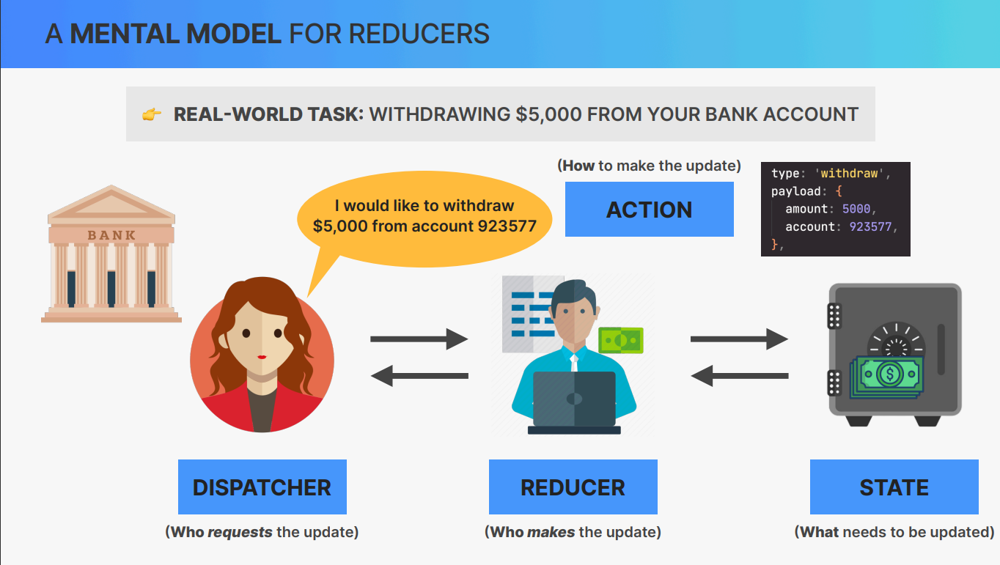

## Use Reducer hook 


👉 use reducer hook returns an array of two elements
👉 first element is the current state second element is the dispatch function

✅  it also take two parameters
👉 first parameter is the reducer function
👉 second parameter is the initial state


## WHY USE REDUCER HOOK ? 

👉 **State MANAGEMENT WITH useState is NOT ENOUGHT IN CERTAIN SIUATIONS:**

1. When components have **a lot of state variables and state updates**, spread across many event handlers **all over the component** 

2 When **multiple state updates** need to happen at the same time (as a reaction to the same event, like “starting a game”)

3 When updating one piece of state **depends on one or multiple other pieces of state**

👉 **IN ALL THESE SIUATIONS , useReducer CAN BE OF GREAT HELP**

## MANAGING STATE WITH useReducer

### STATE WITH useReducer

👉An alternative way of setting state, ideal for complex state and related pieces of state 

```jsx

const [state, dispatch] = 
    useReducer(reducer, initialState);

```

```jsx
function reducer(state, action) {
    switch (action.type) {
        case 'increment':
            return state + 1;
        case 'decrement':
            return state - 1;
        default:
            throw new Error('Unexpected action');
    }
}

```

👉 Stores realted pieces of state in a **state** object 

👉useReducer needs reducer: function containing **all logic to update state. Decouples state logic from component**

👉 reducer: pure function (**no side effects!**) that takes 
current state and action, and returns the next state

👉 action: object that describes how to update state

👉 dispatch: function to trigger state updates, by “sending” actions from event handlers to the reducer


## HOW REDUCERS UPDATE STATE 


```
const [state, dispatch] = useReducer(reducer, initialState);

👉 updating state
  in Component 
        |    just like array.reduce(),reducers 
        |    accumulate ("reduce") action over time
        |             |
        |             |  
        |             |      (returns)
    Dispatch -----> reducer -----> Next State -----> RE-RENDER
   ---------------------   
   |     action         |
   |  type="updateDay"  |
   |    payload=23      |    
   |____________________|

action an Object that contains information
on how the reducer should update state 

```

## A MENTAL MODEL FOR REDUCERS 




## USESTATE **VS** USEREDUCER 

| useState | useReducer |
| --- | --- |
|👉 Ideal for single, independent pieces of state (numbers, strings, single arrays, etc.)|👉Ideal for multiple related pieces of state and complex state (e.g. object with many values and nested objects or arrays)||👉 Logic to update state is placed directly in event handlers or effects, spread all over one or multiple components|||👉Logic to update state lives in one central place, decoupled from components: the reducer|
|👉 State is updated by calling setState (setter returned from useState)|👉State is updated by dispatching an actionto a reducer|
|👉 Imperative state updates|👉Declarative state updates: complex state transitions are mapped to actions|
|👉 Easy to understand and to use|More difficult to understand and implement|