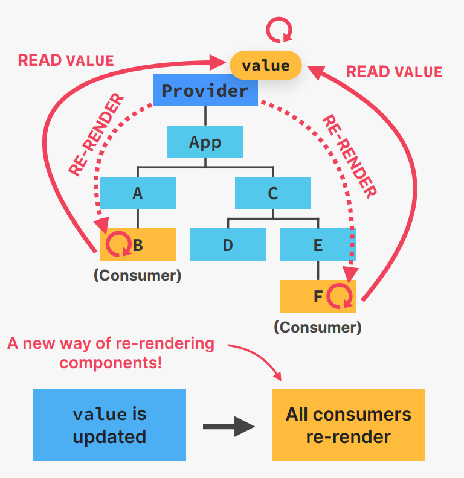

## WHAT IS CONTEXT API 

### A solution to PROP DRILLING 

👉 **TASK:** **Passing state into multiple deeply nested child components**

```
           App(count)
            |
    ---------------------
    |                   |
    A                   c
    |                   |
    B           ---------------
                |             |
                D             E
                              |
                              F

`let's say Components that need count state is B,f`

```

`Solutions:`

👉 **1** Pass the props to the different level. 

💊 <span style="color:red;">**PROBLEM: "PROP DRILLING"**</span>

👋 A good solution to "prop drilling " is **better component composition**

But it is not always possible to do so.


👉 **2** Directly pass the props to the component that needs it.

**CONTEXT-API**

👉 System to pass data throughout the app 
**without manually passing props** down the tree

👉 Allows us to **“broadcast” global state** to the entire app

1. **Provider**: gives all child components 
access to value
2. **value**: data that we want to make 
available (usually state and functions)
3. **Consumers**: all components that read the provided context value



## useContext Hook


## A custom Proiver and HOOK

