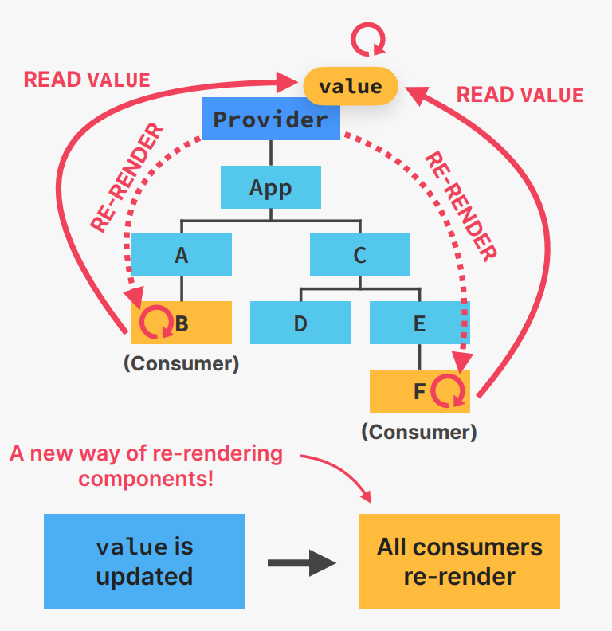
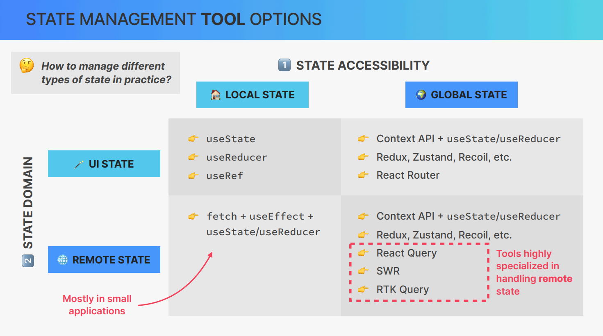

## WHAT IS CONTEXT API 

### A solution to PROP DRILLING 

👉 **TASK:** **Passing state into multiple deeply nested child components**

```
           App(count)
            |
    ---------------------
    |                   |
    A                   c
    |                   |
    B           ---------------
                |             |
                D             E
                              |
                              F

`let's say Components that need count state is B,f`

```

`Solutions:`

👉 **1** Pass the props to the different level. 

💊 <span style="color:red;">**PROBLEM: "PROP DRILLING"**</span>

👋 A good solution to "prop drilling " is **better component composition**

But it is not always possible to do so.


👉 **2** Directly pass the props to the component that needs it.

**CONTEXT-API**

👉 System to pass data throughout the app 
**without manually passing props** down the tree

👉 Allows us to **“broadcast” global state** to the entire app

1. **Provider**: gives all child components 
access to value
2. **value**: data that we want to make 
available (usually state and functions)
3. **Consumers**: all components that read the provided context value



## useContext Hook


## A custom Proiver and HOOK


## REVIEW : **WHAT IS STATE MANAGEMENT?**

🏠 **STATE MANAGEMENT :** Giving each piece of state the right **home**

✅ **when** to use state 

✅ **Types** of state (**accessibility**): local vs. global

### Types of State 

1️⃣  **STATE ACCESSIBILITY** 

|🏡**LOCAL STATE**|   VS | 🌏**GLOBAL STATE**|
|-----------------|-----|------------------|
|👉 Needed only by **one or few Components**| |👉 Needed by **many components**|
|👉 Only accessible in **Component and its children**| |👉 Accessible **anywhere** in the app|

`if thie component was rendered twice, should a state update in one of them reflect in the other one ?`

if no, then it is a local state.

but if yes, then it is a global state.


2️⃣ **STATE DOMAIN**

|REMOTE STATE|VS|UI STATE|
|------------|--|--------|
|👉 All application data **loaded from a remote server (API)||👉 **Everything else ** 😅|
|Usually **asynchronous**|| | 👉 Theme,list filters,form data,etc.|
|👉 Needs re-fetching + updating||👉 Usually **synchronous** and stored in the application |


## STATE **PLACEMENT**

### WHERE TO PLACE STATE ? 


|Component|TOOLS|WHEN TO USE?|
|-----|-----|-----------|
|🏠 Local component |useState, useReducer, or useRef |**Local state**|
|👪 Parent component |useState, useReducer, or useRef| Lifting up state|
|🛞 Context| Context API + useState or useReducer| Global state (preferably UI state)|
|🧧 3rd-party library| Redux, React Query, SWR, Zustand, etc. |Global state (remote or UI)|
| URL |React Router| Global state, passing between pages|
|💻 Browser| Local storage, session storage, etc.| Storing data in user’s browser|


