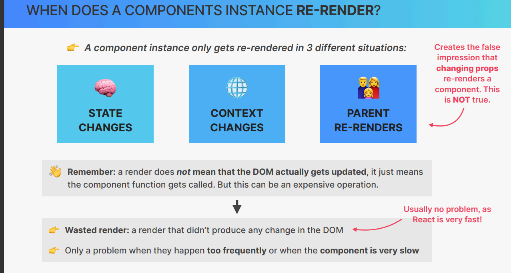
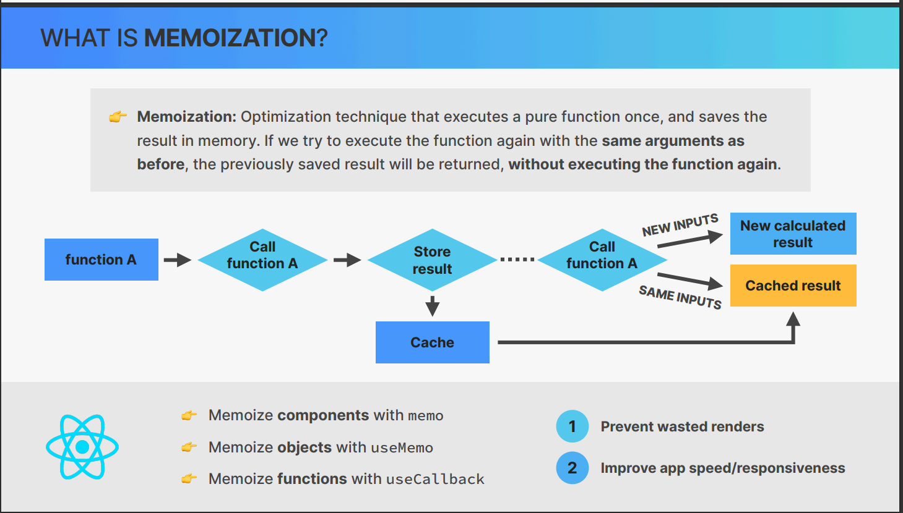
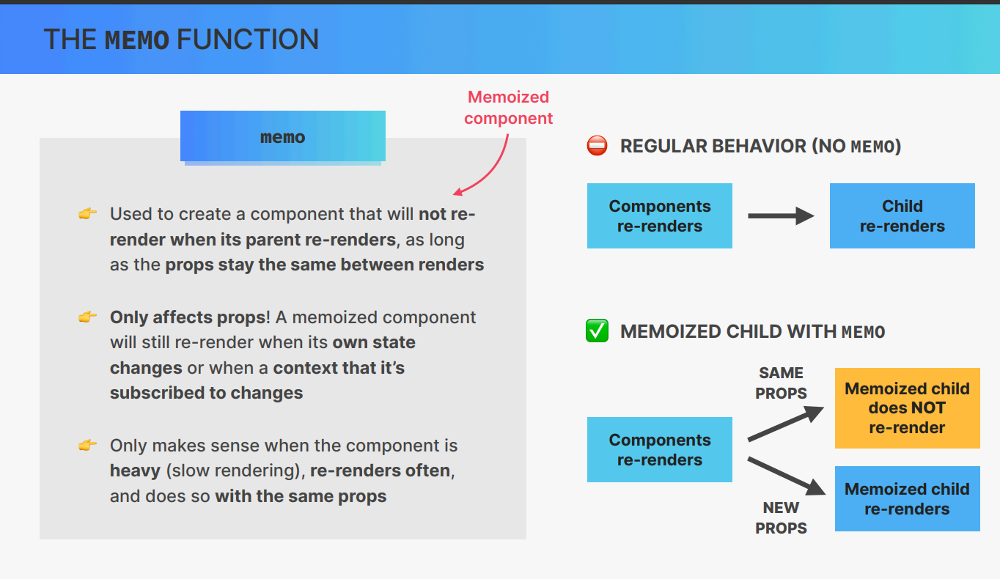
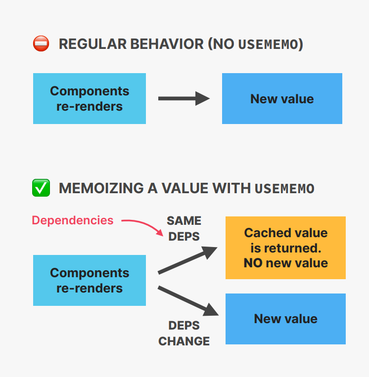
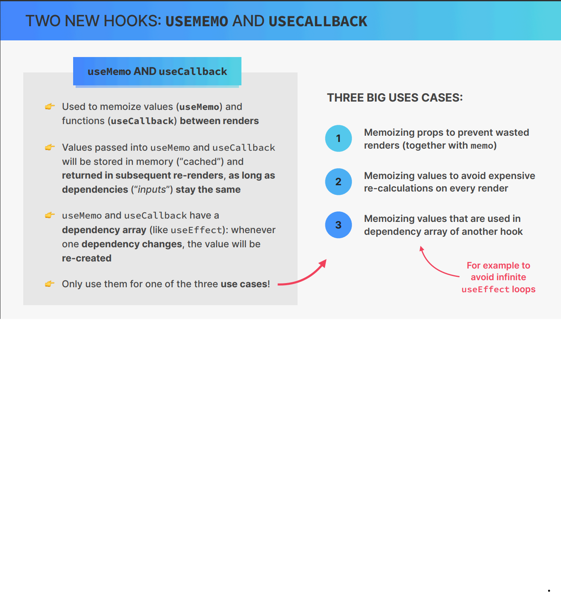
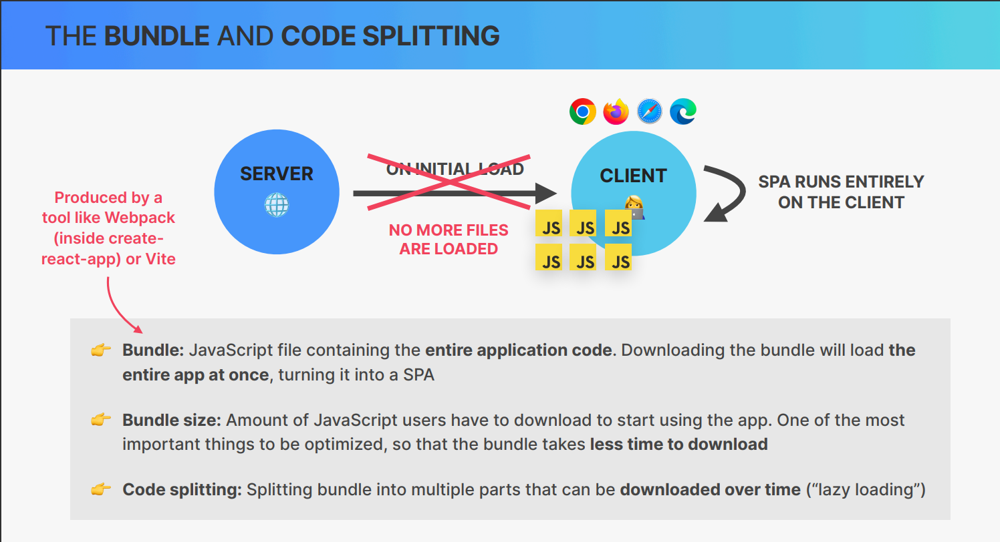

## PERFORMANCE OPTIMIZATION TOOLS 

### 1. Prevent wasted Renders 

        👉 memo
        👉 useMemo
        👉 useCallback
        👉 Passing element as children to regular prop

### 2. Improve app speed/reponsiveness

    👉 useMemo
    👉 useCallback
    👉 useTransition

### 3. Reduce bundle size

    👉 Using fewer 3rd package 
    👉 code splitting and lazy loading 

👋 This list of tools and techniques is, by no means, exhaustive. You’re already doing 
many optimizations by following the best practices I have been showing you ✌

## When Does a Component instance RE-RENDER? 

## The Profiler Dev Tool

This dev tool is used to measure the performance of a React app. It can be used to

- Flamegraph: visualize how much time it takes to render each component

The color of the component specifies the time it takes to render the component or the component is re-rendered or not.

`The reson of the re-rendering is also shown in the flamegraph.`

## AN ISSUE WITH MEMO : 

`In React everything` is **re-created on every render** (including objects and function)
                |
                |
In javascript, two objects or functions that look the same, **are actually different**. {{}!={}}
                |
  therefore     |
                |

If objects or functions are passed as props, the child componenet will always see them as **new props on each re-render**

                |
                |
                |
If props are different between ren-renders, memo will not work 

                |
                |
                |

We need to memoize objects and functions, to make them stable (preserve) between re-renders
(memozied {} === memoized {})

## TWO NEW HOOKS : USEMEMO AND USECALLBACK

### useMemo and useCallback

👉 Used to memoize values (**useMemo**) and 
functions (**useCallback**) **between renders**

👉 Values passed into useMemo and useCallback
will be stored in memory (“cached”) and 
**returned in subsequent re-renders, as long as dependencies (“inputs”) stay the same**

👉 useMemo and useCallback have a 
**dependency array** (like useEffect): whenever one **dependency changes**, the value will be re-created
              

 ⛔ **REGULAR BEHAVIOR (NO USEMEMO)**

### What is stale closure ? 

when a function is created inside another function, it has access to the variables of the outer function.

## OPTIMIZATION CONTEXT RE-RENDERS

1. State in the context changes all the time
2. Context has many consumers.
3. App is slow or laggy

## THE BUNDLE AND CODE SPLITTING 

### React suspense API

👉 Suspense is a new React feature that was released in React 16.6.0. It aims to help with handling async operations respectively in regard to CPU power and data fetching.

