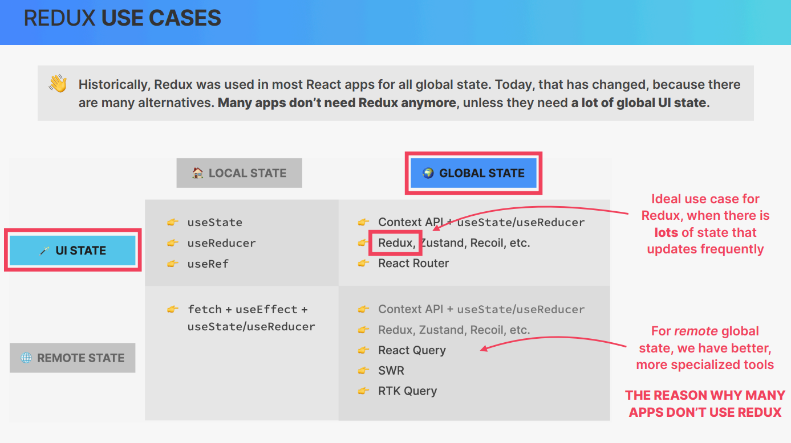
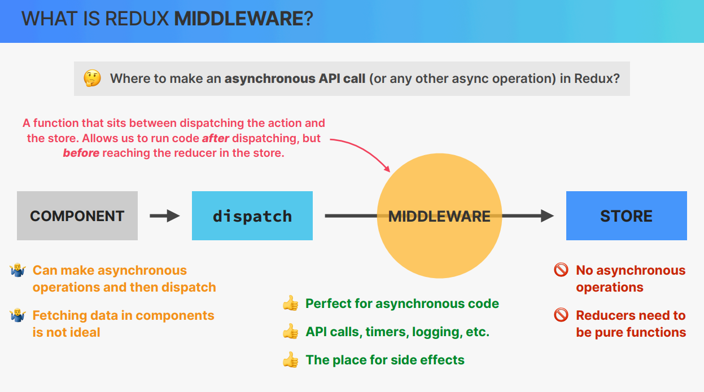
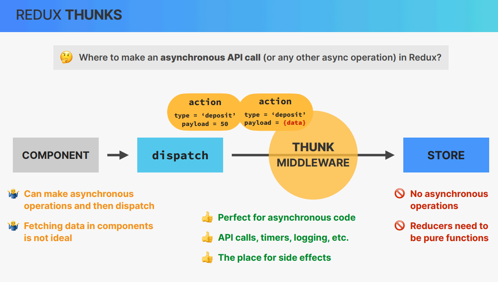

## REDUX 


```
            GLOBAL STORE IS UPDATED
                    |
                    |
                    |
           ALL CONSUMING COMPONENTS RE-RENDER

```

### what is redux?

👉 3rd-party library to manage **global state**

👉 **Standalone** library, but easy to intergrate with React apps using **react-redux** library

👉 All global state is stored in one **globally accessible store**, which is easy to update using **actions** (like useReducer)

👉 It's conceptually similar to using the Context API + useReducer, but with a lot of extra features

👉 Two "versions"
    1: Classic Redux (using class-based components)
    2: Modern Redux Toolkit (using functional components)


`☝️ We need to have a really good understanding of the Context API and useReducer before we can understand Redux`


## DO YOU NEED TO LEARN REDUX ? 


👋 Historically, Redux was used in most React apps for all global state. Today, that has changed, because there are **many alternatives. Many apps don’t need Redux anymore**, unless they need **a lot of global UI state.**

`You might not need to learn Redux`

🤔 **WHY LEARN REDUX?**

1 Redux can be hard to learn, and this course teaches it well �
2 You will encounter Redux code in your job, so you should understand it
3 Some apps do require Redux (or a similar library)




## WHAT IS REDUX **MIDDLEWARE** ?





## WHAT IS **REDUX TOOLKIT** ?

### REDUX TOOLKIT

👉 The **modern and preferred** way of writing Redux code

👉 An **opinionated** approach, forcing us to use Redux best practices

👉 100% compatible with “classic” Redux, allowing us to **use them together**


**ADVANTAGES**

👉 Allows us to write **a lot less code** to achieve the same result (less “boilerplate”)

👉 Gives us 3 big things (but there are many more…):

1. We can write code that **“mutates”** state inside reducers (will be converted to **immutable** logic behind the scenes by “Immer” library)

2. Action creators are **automatically** created

3. **Automatic** setup of thunk middleware and DevTools


