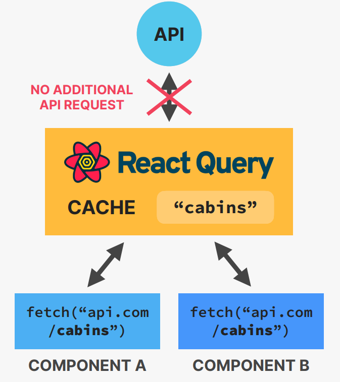

## WHAT IS REACT QUERY? 

👉 Powerful library for managing **remote (server) state**

👉 Many features that allow us to write a **lot less code**,while also **making the UX a lot better**:

    👉 Data is stored in a cache

    👉 Automatic loading and error states

    👉 Automatic re-fetching to keep state synched

    👉 Pre-fetching

    👉 Easy remote state mutation (updating)

    👉 Offline support

👉 Needed because remote state is **fundamentally** different from regular (UI) state

</img>