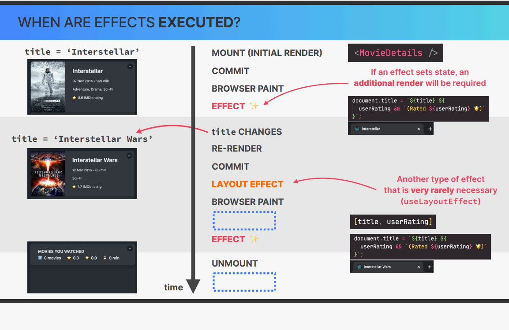

## How to split a UI into Components 

- Components Size Matters 

|Small|Huge|
|:-:|:-:|


## Component Categories

`Most of you components will naturally fall into one of three categories`

1. Stateless/ presentational components
2. Stateful/ container components
3. Structural components

### Stateless/ presentational components

     - No State
     - Can receive props and simply present received data or other content 
     - Usually small and reusable


### Stateful/ container components

     - State
     - Can receive props and manage state
    
### Structural components

    👉 “Pages”, “layouts”, or “screens” of the app
    👉 Result of composition
    👉 Can be huge and non-reusable (but don't have to)

## Prop Drilling

- 👉 Prop drilling is the process of passing props from one component to another component, and to another component, and so on, until it reaches its final destination component.


## Component Composition

### `Using` A Component 

```jsx

function Modal()
{
    return (
        <div className="modal">
            <Sucess/>
        </div>
    )
}


function Sucess()
{
    return (
        <div className="sucess">
            <h1>Success</h1>
        </div>
    )
}

```

- Sucess is inside Modal:   We can't reuse Modal without Sucess
- Want to Reuse ❌

### Composition 

```jsx

function Modal({children})
{
    return (
        <div className="modal">
            {children}
        </div>
    )
}

function Sucess()
{
    return (
        <div className="sucess">
            <h1>Success</h1>
        </div>
    )
}


```
👉 We can REUSE Modal ✅


### Formal Definition 

- 🤙 Component composition `Combining different components using the children props (or explicitly defined props)`

### We component Composition , we Can: 

- 👉 create highly reusable  and composition components
- 👉 Fix prop drilling ( great for layouts )


### Props As AN API


#### Component Consumer 
#### Computer Creator


|Too Little Props | Too Many Props|
|:-:|:-:|
|👉 Not flexible enough | 👉 Too Hard to use |
|might not be useful| 👉 Exposing too much compexity Hard-to-write code|


`We need to find the right balance between too little and too many props, that works for both the consumer and the creator`


## Prop Types 

- 👉 Prop types are a way to document the intended types of properties passed to components

- 👉 Prop types are not enforced, but they are useful for documentation and debugging

- 👉 Prop types are defined as static properties of the component function

- 👉 Prop types are defined using the prop-types package

- 👉 Prop types are only available in development mode

- 👉 Prop types are not available in production mode

# New Section

## Life cycle of the Component

1. Mounting / Intial Render

👉 Component instance is rendered for the first time

👉 Fresh state and props are **created**

2. Re-render 

         Happens when: 
           👉 State changes 
           👉 Props change
           👉 Parent component re-renders
           👉 context changes


3. Unmounting 💀

        👉 Component instance is removed from the DOM
        👉 State and props are destroyed


## How to fetch the Data from in React 


## UseEffect hook  ( React Hooks )

- 👉 useEffect is a hook that allows you to perform side effects in function components

- 👉 useEffect is a replacement for the componentDidMount, componentDidUpdate, and componentWillUnmount lifecycle methods

```jsx
useEffect(() => {
    // code to run on component mount
    // code to run on component update
    return () => {
        // code to run on component unmount
    }
}, [dependencies])


```


## Where to Create SIDE EFFECTS 

👉 REVIEW: A side effect is basically any “interaction between a React component and the world outside the component”. 
We can also think of a side as “code that actually does something”. Examples: Data fetching, setting up subscriptions, 
setting up timers, manually accessing the DOM, etc

### Side Effects are of two types 

1. Event Handlers (Triggred by Event)
2. Effects (useEffect) (Triggred by render)

👉 Effects allow us to write code that will run a **different moments:** mount ,re-render , or unmount 


## EVENT HANDLERS VS EFFECTS


|Event Handlers| Effects|
|:-:|:-:|
|👉 Triggred by Event| 👉 Triggred by render|
|👉 Executed when the coressponding event happens| 👉 Exectued after the component mounts (intial render) ,and after susequent re-renders (according to the dependency array)|


## When the Strict mode in React 18 

It will call the render method twice

`It will not happen in production mode` only in the development mode

## Handling Errors 


## What's the USEEFFECT **DEPENDENCY ARRAY?**

👉 By default, effects run **after every render**. We can prevent that by passing a **dependency array**

👉 Without the dependency array, React doesn’t 
know **when** to run the effect

👉 **Each time one of the dependencies changes, the effect will be executed again**

☝ Every **state variable and prop** used **inside the effect MUST be included in the dependency array**

- if the last point is not followed then it will cause the **BUG** which is known as **STALE CLOSURE BUG**


## How to use the USEEFFECT **DEPENDENCY ARRAY?**

```jsx

const title=props.movie.title;
const [userRating,setUserRating]=useState('');

useEffect(
    function()
    {
        if(!title) return ;
        document.title=`${title} ${
            useRating && `(Rated ${userRating} 🌟)`
        }`;
        return () => {
            document.title='React Movie Cards';
        }

        },[title,userRating]
    }


```

## USEEFFECT IS A **SYNCHRONIZATION** MECHANISM

`THE MECHANISM OF EFFECTS` :

👉 useEffect is like an **event listener** that is listening for one dependency to 
change. **Whenever a dependency changes, it will execute the effect again**.
👉 Effects **react** to updates to state and props used inside the effect (the 
dependencies). So **effects are “reactive”** (like state updates re-rendering the UI)


        Component
                    ---> Synchornization 
                                        -----> External System
                    Mechanism
    (State/props)


## SYNCHRONIZATION AND LIFE CYCLE 


```
            Effect is Executed
                Again
             /                 |     
Dependency  /                  | 
(State or Props          Effect and Component    
Changes )               Are deeply Conntected 
            \
             \
            Component is
            Re-Rendered

```

👉 We can use the dependency array to run effects when the component renders or re-renders


### Synchornization and Life Cycle

|Dependency Array|🔃Synchronization|🐣LifeCycle|
|:-:|:-:|:-:|
|useEffect(fn,[x,y,z]);|Effect Synchronized with x,y,z|Runs on mount and re-render triggered by upating x,y,z|
|useEffect(fn,[]);|Effect Synchronized with nothing|Runs on mount only|
|useEffect(fn);|Effect Synchronized with nothing|Runs on mount and re-render|


## When ARE EFFECTS EXECUTED?




## What is the **CLEANUP FUNCTION**?

👉 The cleanup function is a function that is **returned by the effect function** (option).

👉 Runs on two different occasions:

    1 Before the effect is executed again
    2 After a component has unmounted

```
Component           Exectue effect if
            --->    dependency array
Renders             includes updated data

Component 
            --->   Execute cleanup function
Umounts

```

👉 Necessary whenever the side effect keeps 
happening after the component has been 
re-rendered or unmounted


|✨ EFFECT |🧹 POTENTIAL CLEANUP|
|:-:|:-:|
|👉HTTP Request|👉Cancel the request|
|👉API Subscription|👉Unsubscribe from the API|
|👉Start Timer|👉Stop the timer|
|👉Add Event Listener|👉Remove the event listener|


☝ Each effect should do only one thing! Use 
one useEffect hook for each side effect. 
This makes effects easier to clean up


## Cleaning up Data Fetching

`Race Condition` : 

It is a condition which occurs when two or more threads (or processes) try to access the same resource at the same time and the output of the program depends on the order in which the access takes place.


### `AbortController`

👉 The AbortController interface represents a controller object that allows you to abort one or more DOM requests as and when desired.