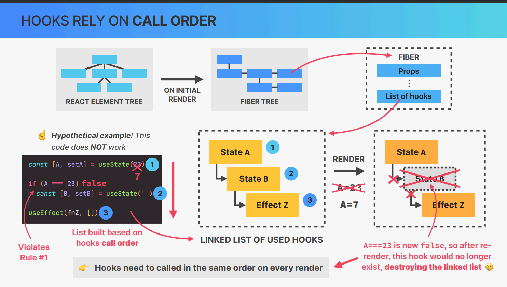
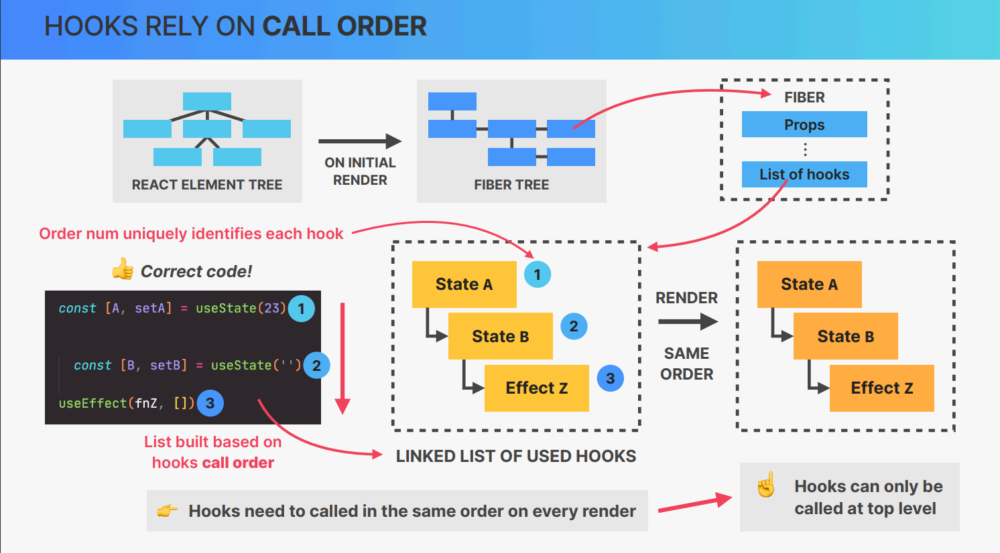

# CUSTOM HOOKS, REFS, AND MORE STATE

## What are React HOOKS ? 

👉 Special built-in functions that alllow us to **"hook" into React internals**
        
         👉Creating and accessing state from Fiber Free 
         👉 Registering side effects from Fiber Free
         👉 Manual Dom selecions
         👉 Many more ...

👉 Enable easy reusing of non-visual logic: we can compose multiple hooks into 
our own custom hooks
👉  Give function components the ability to own state and run side effects at 
different lifecycle points (before v16.8 only available in class components)

## Overview of ALL **BUILT-IN HOOKS**

- There are around 20 built-in hooks

### Most Used 

✅ useState

✅ useEffect

👉  useReducer

👉  useContext

### Less Used

👉  useRef
👉  useCallback
👉  useMemo
👉  useTransition
👉  useDeferredValue

❌  useLayoutEffect
❌  useDebugValue
❌  useImperativeHandle
❌  useId

❌ : not in the notes

## Only for Libararies

❌ useSyncExternalStore
❌ useInsertionEffect

## THE **RULES** OF HOOKS 

1. Only call hooks at the **top level** of your components

        👉 Do NOT call hooks inside conditionals, loops, nested functions, or after an early return
        👉 This is necessary to ensure that hooks are always called in the same order (hooks rely on this)

2. Only call hooks from **React function components** or from custom hooks

👋 These rules are automatically enforced by React’s ESLint rules

## HOOKS RELY ON **CALL ORDER**

👉 Hooks rely on the order in which they are called

